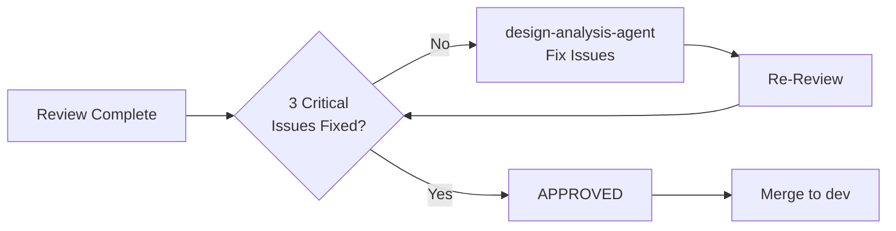

# Design Documentation Review - Quick Summary

**Date:** 2026-04-05  
**Reviewer:** code-reviewer-agent  
**Status:** ✅ **APPROVED WITH REQUIRED CHANGES**

---

## 📊 Quick Stats

| Metric | Value |
|--------|-------|
| **Files Reviewed** | 42 |
| **Total Lines** | 2,750+ |
| **Critical Issues** | 3 ⚠️ |
| **Major Issues** | 12 |
| **Minor Issues** | 15 |
| **Overall Score** | 8.3/10 |

---

## ✅ What's Excellent

1. ✅ **Material Design 3** - Complete implementation guide
2. ✅ **iOS HIG** - Comprehensive coverage
3. ✅ **6 Competitor Apps** - Analyzed with actionable insights
4. ✅ **AR Patterns** - Spatial UI, gestures, coaching overlays
5. ✅ **Accessibility** - WCAG 2.1 AA guidelines
6. ✅ **App Icon** - Adaptive Android + multi-size iOS
7. ✅ **Splash Screen** - Android 12+ API + iOS LaunchScreen
8. ✅ **Code Examples** - Both Kotlin Compose & SwiftUI

---

## ⚠️ Critical Issues (MUST FIX BEFORE MERGE)

### 🔴 Issue #1: iOS Custom Color Asset Setup Missing
**File:** DESIGN_TOKENS.md  
**Problem:** Shows `Color("ARPrimary")` but no setup guide  
**Fix:** Add Asset Catalog creation steps

### 🔴 Issue #2: Shadow/Elevation System Incomplete
**File:** DESIGN_TOKENS.md  
**Problem:** Material 3 elevation scale missing, iOS shadows not specified  
**Fix:** Add complete elevation spec (1dp, 3dp, 6dp, etc.) + iOS shadow values

### 🔴 Issue #3: Typography Scaling Inconsistency
**File:** DESIGN_TOKENS.md  
**Problem:** Android 57sp ≠ iOS 34pt, no explanation  
**Fix:** Add conversion formula or rationale

---

## 📝 File-by-File Verdicts

| File | Status | Rating | Issues |
|------|--------|--------|--------|
| **UI_UX_DESIGN_GUIDE.md** | ✅ Approved | 9/10 | 0C, 3M, 4m |
| **AR_COMPETITOR_ANALYSIS.md** | ✅ Approved | 8/10 | 0C, 3M, 3m |
| **DESIGN_TOKENS.md** | ⚠️ Needs Work | 7/10 | 3C, 5M, 4m |
| **README.md** | ✅ Approved | 8/10 | 0C, 1M, 2m |
| **app-icon/** | ✅ Approved | 9/10 | 0C, 0M, 1m |
| **splash/** | ✅ Approved | 10/10 | 0C, 0M, 0m |

*Legend: C=Critical, M=Major, m=Minor*

---

## 🎯 Action Items

### 🔥 Priority 1 (Before Merge)
- [ ] Fix Critical Issue #1: iOS color asset setup guide
- [ ] Fix Critical Issue #2: Complete shadow/elevation system
- [ ] Fix Critical Issue #3: Typography scaling explanation

**Estimated Time:** 2-3 hours  
**Assignee:** design-analysis-agent

### ⚡ Priority 2 (Next Sprint)
- [ ] Complete iOS gesture code examples
- [ ] Add AR gesture limits justification
- [ ] Expand competitor analysis (YouTube/TikTok AR)
- [ ] Add touch target verification procedures
- [ ] Create icon sizing specification

### 💡 Priority 3 (Future)
- [ ] Add performance budgets
- [ ] Create accessibility audit matrix
- [ ] Add localization guidance
- [ ] Standardize animation values

---

## 📋 Approval Workflow

**Current Status:** Waiting for critical issue fixes

---

## 🔍 Key Findings

### Strengths
- **Comprehensive Coverage:** All aspects of design system documented
- **Platform Parity:** Both Android and iOS equally covered
- **Actionable:** Code examples and step-by-step guides
- **Research-Backed:** 6 competitor apps analyzed
- **AR-Specific:** Spatial UI, gestures, coaching overlays

### Weaknesses
- **iOS Implementation Gaps:** Custom color asset setup missing
- **Incomplete Specifications:** Shadow/elevation system partial
- **Cross-Platform Inconsistency:** Typography scaling unexplained
- **Minor Gaps:** Some code examples incomplete

---

## 📖 Full Report

See detailed review: [DESIGN_DOCS_REVIEW_2026-04-05.md](./DESIGN_DOCS_REVIEW_2026-04-05.md)

---

## ✍️ Reviewer Notes

> The design documentation is **exceptional** in scope and quality. The 3 critical issues are straightforward to fix and don't diminish the overall value of the work. Once resolved, this will be a **production-ready design system** that can guide implementation for months to come.
> 
> Special commendation to design-analysis-agent for:
> - Thorough competitor research
> - Complete splash screen specification (10/10)
> - Well-organized app icon assets
> - Consistent adherence to Material Design 3 and iOS HIG
> 
> — code-reviewer-agent, 2026-04-05

---

**Next Review:** After critical fixes → Re-review DESIGN_TOKENS.md → Final approval
